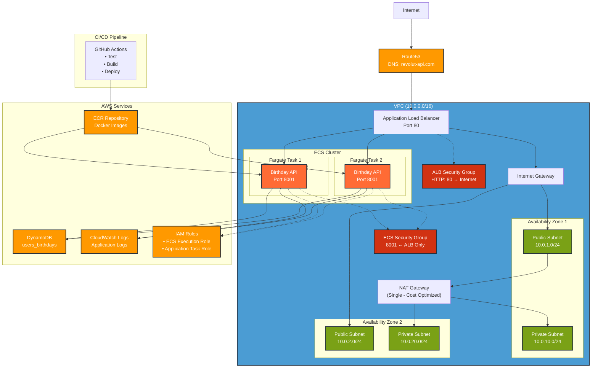

# AWS Architecture Diagram - Revolut Birthday API

## Overview
This diagram shows the complete AWS infrastructure for the Revolut Birthday API application deployed using ECS Fargate with high availability and cost optimization.

## Architecture Diagram

## Key Components

### 🌐 **Networking Layer**
- **VPC**: `10.0.0.0/16` - Isolated network environment
- **Public Subnets**: `10.0.1.0/24`, `10.0.2.0/24` - For ALB and NAT Gateway
- **Private Subnets**: `10.0.10.0/24`, `10.0.20.0/24` - For ECS tasks
- **Internet Gateway**: Provides internet access to public subnets
- **NAT Gateway**: Single gateway for cost optimization, provides internet access to private subnets

### ⚖️ **Load Balancing & Routing**
- **Application Load Balancer**: Distributes traffic across ECS tasks
- **Route53**: DNS management for `revolut-api.com`
- **Target Group**: Health checks on `/hello/healthcheck`

### 🐳 **Compute Layer**
- **ECS Cluster**: Container orchestration platform
- **Fargate Tasks**: Serverless containers running the Birthday API
- **Auto Scaling**: Automatic scaling based on demand

### 🗄️ **Data Layer**
- **DynamoDB**: NoSQL database storing user birthdays
- **Table**: `users_birthdays` with username as primary key

### 🔐 **Security & Access**
- **IAM Roles**:
  - ECS Execution Role: For container lifecycle management
  - Application Task Role: For DynamoDB and CloudWatch access
- **Security Groups**:
  - ALB SG: Allows HTTP traffic from internet
  - ECS SG: Allows traffic only from ALB

### 📦 **Container Management**
- **ECR Repository**: Private Docker image registry
- **CloudWatch Logs**: Centralized logging for all containers

### 🔄 **CI/CD Pipeline**
- **GitHub Actions**: Automated testing, building, and deployment
- **Workflow**: Test → Build → Push to ECR → Update ECS Service

## Traffic Flow

1. **User Request**: `revolut-api.com/hello/john` → Route53
2. **DNS Resolution**: Route53 → ALB Public IP
3. **Load Balancing**: ALB → ECS Task (Port 8001)
4. **Application Processing**: FastAPI → DynamoDB query
5. **Response**: DynamoDB → FastAPI → ALB → User

## High Availability Features

- ✅ **Multi-AZ Deployment**: Resources spread across 2 availability zones
- ✅ **Auto Scaling**: ECS service automatically scales based on demand
- ✅ **Health Checks**: ALB monitors application health
- ✅ **Rolling Updates**: Zero-downtime deployments via ECS

## Cost Optimization

- 💰 **Single NAT Gateway**: Shared across all private subnets
- 💰 **Fargate**: Pay only for running containers
- 💰 **DynamoDB On-Demand**: Pay per request model
- 💰 **CloudWatch**: Efficient log retention policies

## Security Best Practices

- 🔒 **Private Subnets**: Application containers not directly accessible from internet
- 🔒 **Security Groups**: Least privilege access rules
- 🔒 **IAM Roles**: Fine-grained permissions for AWS services
- 🔒 **VPC Isolation**: Network-level security boundaries
